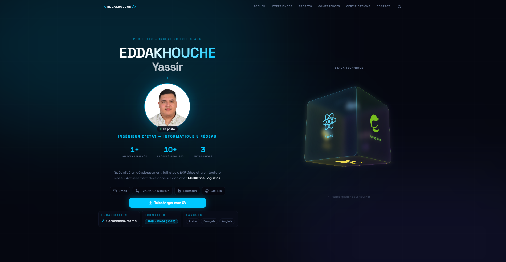

<div align="center">

# EDDAKHOUCHE Yassir — Portfolio

**Ingénieur d'État en Informatique & Réseau**

[](https://reactjs.org/)
[](https://www.typescriptlang.org/)
[](https://vitejs.dev/)
[](https://tailwindcss.com/)

[](https://www.linkedin.com/in/yassir-eddakhouche/)
[](https://github.com/YassirEdk)
[](mailto:yassireddakhouche@gmail.com)

---



</div>

---

## ✨ Fonctionnalités

- **Thème Cinématique** — Dark/Light mode avec transition fluide et arrière-plan parallaxe dynamique
- **Arrière-plan vivant** — Orbes colorées qui morphent selon la section active au scroll
- **Cube 3D interactif** — Stack technique visualisé en 3D, draggable à la souris
- **Curseur personnalisé** — Cercle, dot, I-beam (sélection texte), grab/grabbing (cube), blanc sur CV button
- **Compteurs animés** — Statistiques (expérience, projets, entreprises) qui s'animent à l'entrée
- **Barre de progression** — Indicateur de scroll lumineux en haut de page
- **Formulaire de contact** — EmailJS avec auto-reply au visiteur
- **Police Space Grotesk** — Typographie moderne et technique
- **Responsive** — Mobile, tablette et desktop optimisés
- **Animation au clic** — Rings d'onde sur la photo de profil

---

## 🛠️ Stack Technique

| Catégorie | Technologies |
|-----------|-------------|
| **Framework** | React 18 + TypeScript |
| **Build** | Vite 5 |
| **Style** | Tailwind CSS + ShadCN UI |
| **Formulaire** | EmailJS |
| **Police** | Space Grotesk (Google Fonts) |
| **Icônes** | Lucide React + Devicon |
| **Versioning** | Git + GitHub |

---

## 🚀 Installation

```bash
# 1. Cloner le dépôt
git clone https://github.com/YassirEdk/Eddakhouche-prtfl.git
cd Eddakhouche-prtfl

# 2. Installer les dépendances
npm install

# 3. Lancer le serveur de développement
npm run dev
```

Ouvrir [http://localhost:8080](http://localhost:8080) dans le navigateur.

```bash
# Build de production
npm run build
```

---

## 📁 Structure du projet

```
Eddakhouche-prtfl/
├── public/
│   ├── favicon.svg              # Icône personnalisée
│   ├── preview.png              # Aperçu du portfolio
│   └── ...                      # Logos des entreprises
├── src/
│   ├── components/
│   │   ├── CinematicBackground.tsx  # Arrière-plan parallaxe dynamique
│   │   ├── Cube3D.tsx               # Cube interactif 3D
│   │   ├── Cursor.tsx               # Curseur personnalisé
│   │   ├── Hero.tsx                 # Section principale
│   │   ├── ExperienceCard.tsx       # Expériences professionnelles
│   │   ├── Projects.tsx             # Projets académiques
│   │   ├── Skills.tsx               # Compétences techniques
│   │   ├── Certifications.tsx       # Certifications
│   │   ├── Contact.tsx              # Formulaire de contact
│   │   ├── Navbar.tsx               # Navigation
│   │   ├── Footer.tsx               # Pied de page
│   │   └── ScrollProgress.tsx       # Barre de progression
│   ├── hooks/
│   │   └── use-scroll-animation.tsx # Hook d'animation au scroll
│   ├── pages/
│   │   └── Index.tsx                # Page principale
│   ├── App.tsx
│   └── index.css                    # Variables CSS + thème
├── index.html
├── tailwind.config.ts
└── package.json
```

---

## 📬 Contact

| | |
|---|---|
| **Email** | [yassireddakhouche@gmail.com](mailto:yassireddakhouche@gmail.com) |
| **LinkedIn** | [linkedin.com/in/yassir-eddakhouche](https://www.linkedin.com/in/yassir-eddakhouche/) |
| **GitHub** | [github.com/YassirEdk](https://github.com/YassirEdk) |
| **Téléphone** | +212 682-546896 |
| **Localisation** | Casablanca, Maroc |

---

<div align="center">

Made with ❤️ by **Yassir Eddakhouche**

</div>
